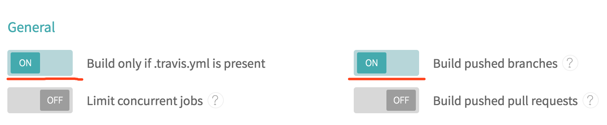
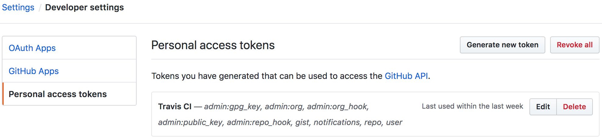
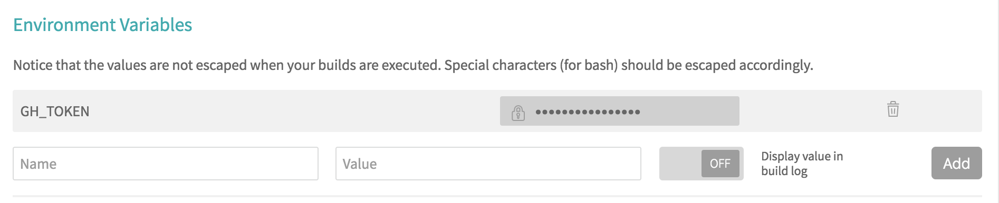

### Travis CI部署hexo

> 几个配置
---
- 在[Travis CI官网](https://www.travis-ci.com/)中通过github账号登录
- 选择需要构建的项目


- Settings中勾选这两项



- github settings中生成一个Personal access tokens



- 将tokens配置在构建项目settings中的Environment Variables（Name自定义，Value是github中生成的token）



>  hexo项目的操作
---
1.  新建并且切换到分支source

``` bash
git checkout -b source
```

2. 将本地hexo项目源码复制过来并且新建一个.travis.yml文件（Travis-CI的部署配置文件）

```yaml
language: node_js
node_js: stable
install:
  - npm install
script:
  - hexo clean && hexo g

after_script:
  - cd ./public
  - git init
  - git config user.name "xxx"
  - git config user.email "xxx"
  - git add .
  - git commit -m ":memo:\ Update blog by Travis CI"
  - git push --force --quiet "https://${GH_TOKEN}@${GH_REF}" master:master

branches:
  only:
    - source
env:
 global:
   - GH_REF: github.com/xxx/xxx.github.io.git
```

3. push分支到远程Travis-CI branch

``` bash
git push origin source:source
```
> 最后
---
*只需要在source/_posts/文件夹下增删改.md文件然后push分支就可以了,剩下的事情就交给Travis CI了*
