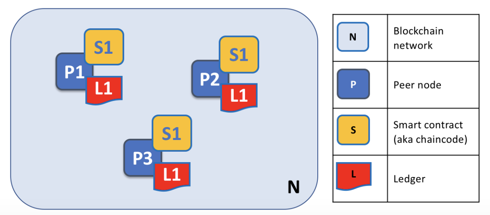
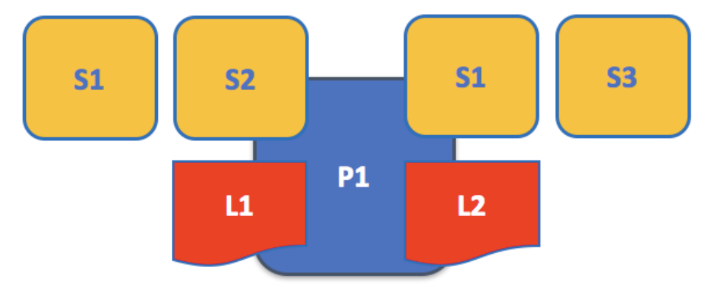
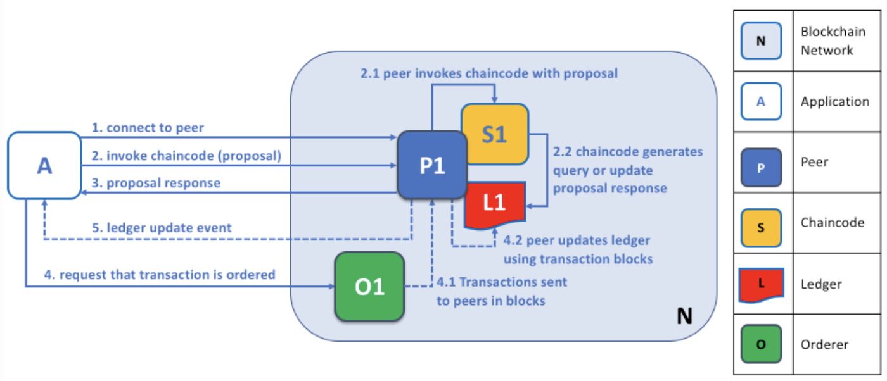
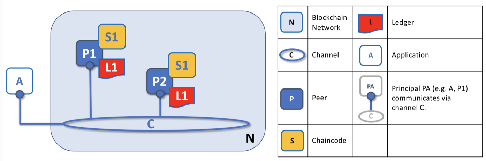
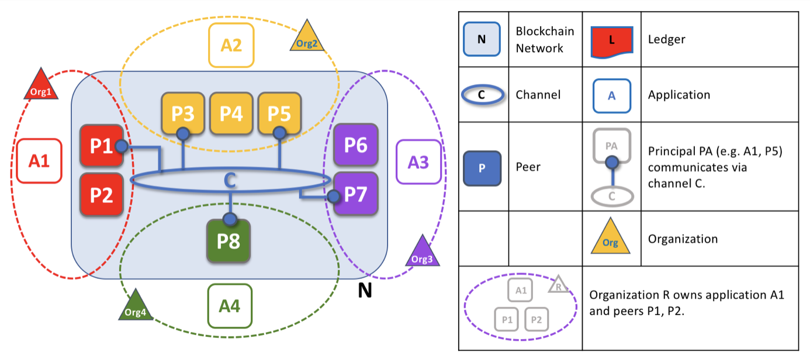
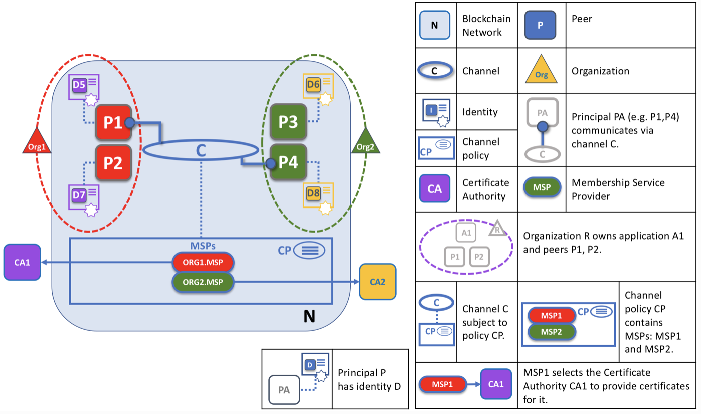
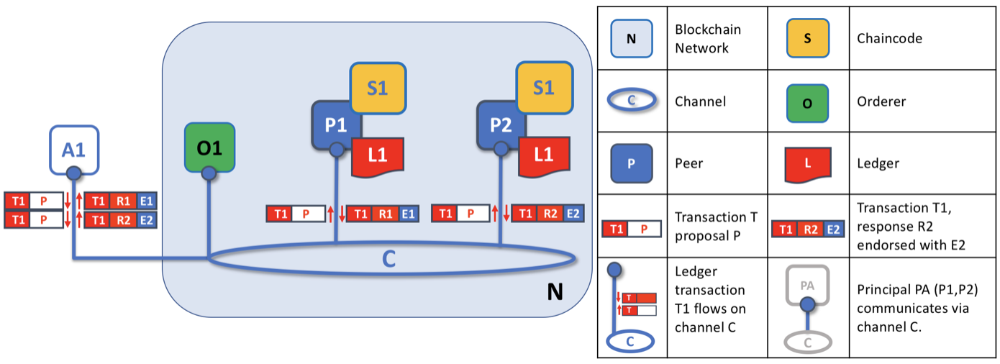
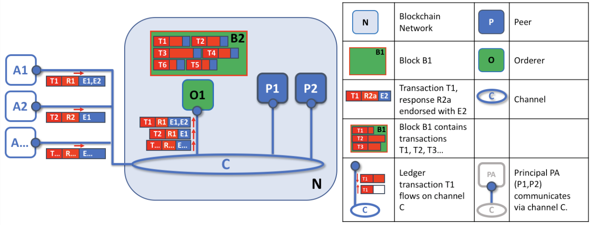
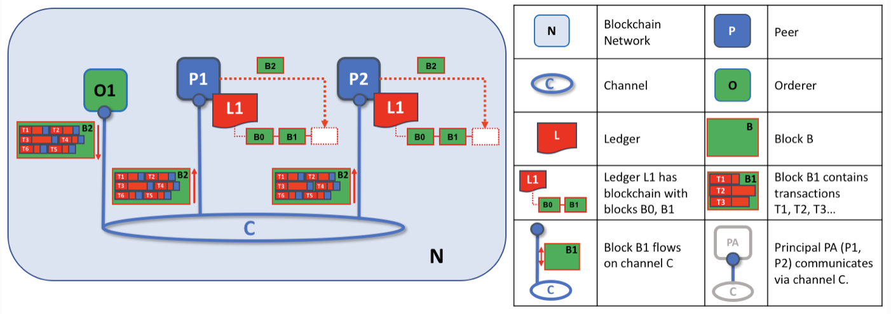

# Fabric节点间的网络架构

## 4种不同类型的服务节点

- 背书节点 (Endorser):负责对交易的提案(proposal)进行检查和背书，计算交易执行结果
- 确认节点( Committer):负责在接受交易结果前再次检查合法性，接受合法交易对账本的修改，并写入区块链结构
- 排序节点 ( Orderer) :对所有发往网络中的交易进行排序，将排序后的交易按照配置中的约定整理为区块，之后提交给确认节点进行处理
- 证书节点( CA):负责对网络中所有的证书进行管理，提供标准的PKI(公钥基础设施)服务

## Peer节点

 > 一个网络实体，维护ledger并运行Chaincode容器来对ledger执行read-write操作

Peer节点可以担任多种角色

- 背书节点
- 确认节点
- 主节点(Leader Peer)
- 锚节点(Anchor Peer)

每一个peer节点持有一个或多个账本，以及一个或多个智能合约。
网络N由三个peer组成P1、P2和P3。每一个Peer都持有了一个账本实例L1；每个peer都通过链码（智能合约）S1去访问各自的账本L1。

## Chaincode链码

> 对账本操作的的代码（读写）

*多账本和多链码*

## Application

> Application与Peer的交互主要包括账本查询与账本更新。账本查询只需要简单的三次会话；而账本更新需要额外的两次会话。超级账本提供的SDK可以允许application连接peer、调用链码产生交易、提交交易到整个网络并接收处理过程中产生的事件。

通过连接到一个peer，application执行链码来查询或者更新账本。查询结果可以很快返回；但是更新账本需要更复杂的交互，这些交互涉及到application、peer还有orderer：

*Orderer用来确保所有的Peer持有的账本同步更新*

- 账本查询：

1. application连接到peer
2. application生成提案，并将提案提交给peer
3. peer根据提案调用相应的链码执行
4. 链码根据提案查询对应的超级账本
5. 向application返回提案应答

- 账本更新：

1. application根据查询的返回结果生成一个交易并发送给排序服务模块(Orderer)
2. orderer将交易发给网络内的所有节点(peers)
3. peer根据交易调用相关的链码完成账本更新
4. 账本更新完成后产生事件通知application更新完成

## 通道(Channel)

> 通道为网络中的所有模块提供了私有的沟通与交易渠道。这些模块包括peer节点、oderder节点、application。加入通道后，这些模块可以共享或管理通道内的所有账本。一个节点可以加入到多个通道中（拥有多个账本），但是每个通道的账本是隔离的。

## 组织(Organizations)

> 一个区块链网络由多个组织组成。

在图中，4个组织提供了8个peers，组成了整个区块链网络。通道C连接了其中的5个peers，其他的节点并没有连接到当前通道。但是其他peers（P2、P4和P6）加入了至少一个其他的通道。每个组织的application只会连接到自己所在组织的peers上。

## 身份

> MSP(Membership Service Provider),MSP是指为client和peer提供证书的系统抽象组件。Client用证书来认证他们的交易;peer用证书认证其交易背书。

当一个Peer加入通道的时候，它的数字签名表明了它所在的组织。如图所示，P1和P2的数字签名有CA1签发；而P3和P4的数字签名由CA2签发。通过配置，通道C知道CA1来自组织ORG1；而CA2来自ORG2。ORG1.MSP和ORG2.MSP由通道的MSP统一管理。

所有的节点在访问区块链网络的时候都需要进行身份认证。包括Peer节点、application、Orderer节点以及管理员等。

## 排序服务(Orderer)

> 排序服务保证了application和Peers在交互的时候账本的一致性。在账本更新的时候，我们需要与网络中其它节点达成共识。通常情况，application需要3个步骤来完成账本更新并保障数据的一致性

1. application将更新提案发给指定的背书节点，背书节点对提案背书，但不更新本地账本，然后将背书结果返回给application。（背书节点是所有节点的一个子集，不要求所有节点参与背书）
2. application将收集所有的背书，然后打包到块中
3. 验证

- 步骤一：提案

application产生一个交易提案，并将提案发送给所有相关的背书Peer节点。每个背书节点根据交易提案独立的执行链码，并返回提案回执。这个阶段背书节点并不更新本地账本，只是对提案签名并返回给application。当application收集到了足够的提案回执，提案阶段就完成了。

如图，A1根据交易T1产生提案P，并分发给通道内的所有背书节点P1和P2。P1和P2分别进行背书，P1调用自己的链码S1产生回执R1和背书E1。P2同理。P1和P2背书完成后将回执发回给application。

- 步骤二：打包

打包操作由排序节点（Orderer）完成。所有application的交易在提案完成背书后，包含背书结果的回执会被发送到排序节点。排序节点会收到来自所有application的各种背书提案，它会对所有交易进行排序然后打包发给所有的Peers（包括先前参与背书的Peer），图中，A1发送的交易T1包含了回执R1和背书E1 E2；A2发送的交易T2包含了回执R2和背书E1。这些交易在排序节点中进行排序打包处理，形成一个块B2。

排序服务节点会同步收到不同application发送的很多交易，排序节点会对这些交易排序，然后打包成块。这些块接下来会发给所有Peer，并成为账本中的新块。

- 步骤三：验证

打包后的交易会被分发到所有节点(Peer)。每个Peer节点会对打包的每一个交易进行验证，以确保每个交易都被相关节点背书，且背书回执是一致的。如果发现不一致，交易将会被审查并保留，不会被写入到账本中。

每个Peer都需要验证接收到的每个交易已经被正确的背书。不同的交易有不同的背书策略，需要不同的组织参与背书。Peer需要确保所有需要参与背书的Peer都参与了背书，并产生了同样的背书结果。

在验证成功后，Peer还需要确保当前账本的状态与交易产生是的账本状态是一致的。这就确保了更新后的账本与网络内的其它账本是一致的。
