# 为什么要学习线性代数

## 学习动机

> 空间想象给我们的直观感受

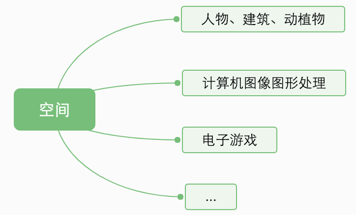

线性代数提供一套便捷的概念和语言讨论空间，n维空间中的现象都可以从直观上进行理解，线性代数的本质就是对线性空间、向量和矩阵的直觉描述

---

- 举个例子
一个搭载了n个传感器的机器人观测到了n组数据

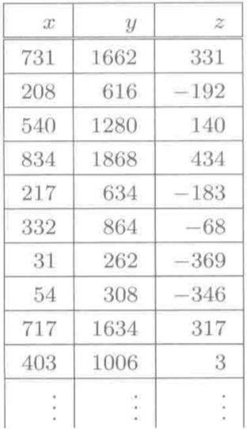

---
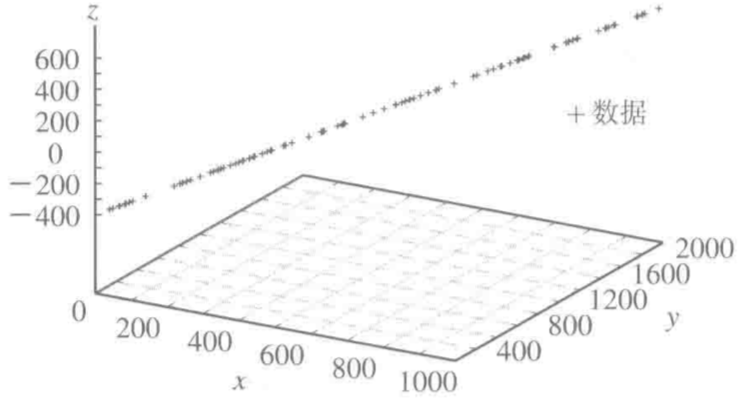

- 总结1：线性代数是数据分析中的一个强大工具

>有效利用线性近似的手段

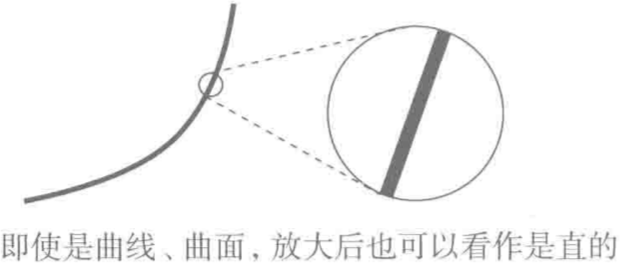

---

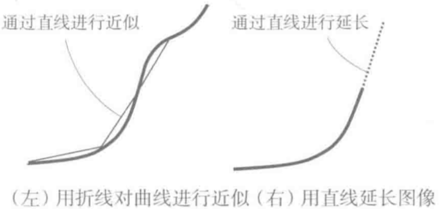

曲线在小范围进行分析，可以通过直线来进行近似

- 总结2：线性代数通过近似的手段可以进行短期的趋势预测

---

*我对学习线性代数的理解：在人工智能、机器学习及其深度学习中，都需要一定量级的数据作支撑，线性代数是数据分析的关键工具，在这些领域通过线性代数来进行分析及其预测。*

## 线性代数中的向量

> 向量与空间

 -- | 字面意思 | 实际意思
---|---| ---
向量|排成一列(行)的数字 | 有向线段、空间内的点

- 把数值罗列起来就是向量

1. 列向量

$$ \begin{pmatrix}
                1\\
                3\\
                \end{pmatrix}
              \begin{pmatrix}
                              3\\
                              5\\
                              7\\
                              \end{pmatrix}
                \begin{pmatrix}
                2\\
                3\\
                5\\
                8\\
                9\\
                \end{pmatrix} $$

2.行向量
$$ (a_1,a_2,\cdots,a_n)$$

- 向量的转置(Transpose)

$$
(2,3,5,8)^T=\begin{pmatrix}2\\3\\5\\8\\\end{pmatrix}\quad
{\begin{pmatrix}2\\3\\5\\8\\\end{pmatrix}}^T = (2,3,5,8)
$$

为了书写方便，列向量通常写成转置写法

- 向量运算

1. 加法：相同维数的向量加法
$$
              \begin{pmatrix}
              x_1\\
              \vdots\\
              x_n\\
              \end{pmatrix}+
                  \begin{pmatrix}
                            y_1\\
                            \vdots\\
                            y_n\\
                            \end{pmatrix}=
                                 \begin{pmatrix}
                                                       x_1+ y_1\\
                                                        \vdots\\
                                                       x_n+ y_n\\
                                                        \end{pmatrix}
              $$
2. 数量乘法：任意常数c和向量的乘法
$$
              c\begin{pmatrix}
              x_1\\
              \vdots\\
              x_n\\
              \end{pmatrix}=
                                 \begin{pmatrix}
                                                       cx_1\\
                                                        \vdots\\
                                                       cx_n\\
                                                        \end{pmatrix}
              $$

> 向量空间的形象

- 二维向量和三维向量可以通过坐标描述出来

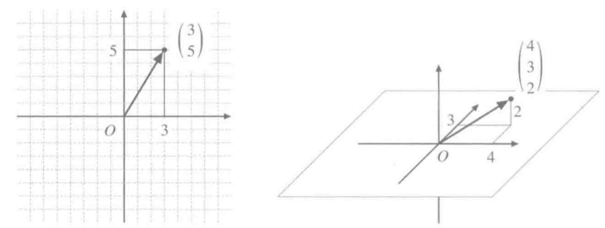

- 通过图形理解向量的加法和数量乘法

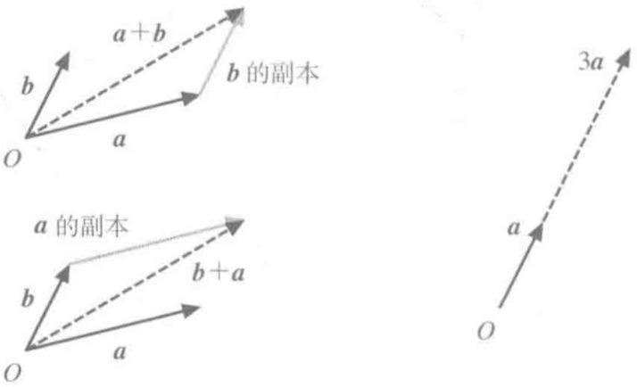

有向线段表示向量时，加法就是线段的连接，数量乘法就是线段的伸缩

> 向量基底

- 宇宙中没有上下左右

没有刻度，没有特定方向，只有参照原点，依然可以进行加法和数量乘法，这个空间叫做向量空间（线性空间）

- 选定基准
*规范向量的计算方式*

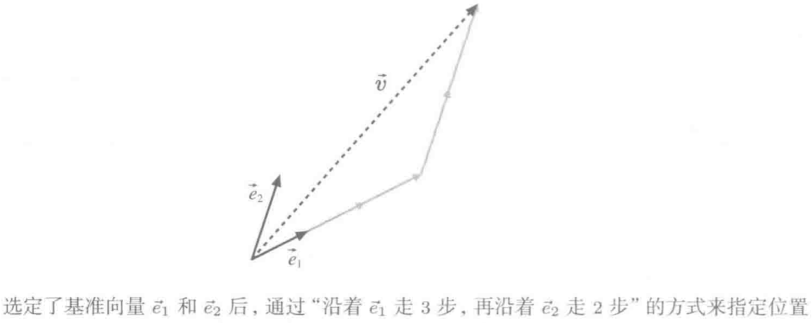

1. 作为基准的一组向量叫**基底**
2. 沿着各个基准向量走的步数叫**坐标**
3. e1、e2叫**基向量**

- 构成基底的条件

1. 当前空间中任何向量都可以表示成：
$$\vec{v} = {x_1}\vec{e_1}+{\cdots}+{x_n}\vec{e_n}$$
2. 这种表示方法是惟一的

- 内积(点乘)
$$
a= \begin{bmatrix}a_1,a_2,\cdots, a_n\end{bmatrix}\quad
b= \begin{bmatrix}b_1,b_2,\cdots, b_n\end{bmatrix}
$$

$$ab = a_1b_1+a_2b_2+ \cdots+ a_nb_n$$

- 外积(叉乘)

- 是否能构成基底的几种情况

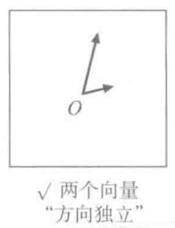

---
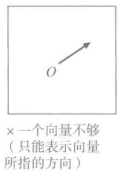

---
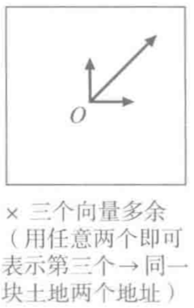

---
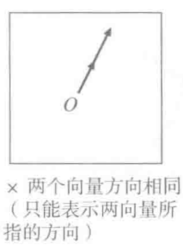

---
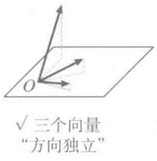

---
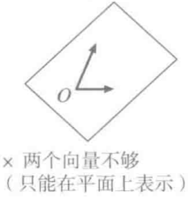

---
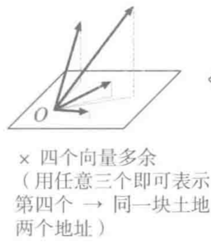

---
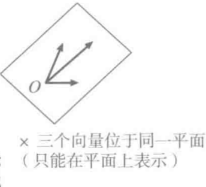

>矩阵和向量的关系

$$vector\subseteq matrix$$
