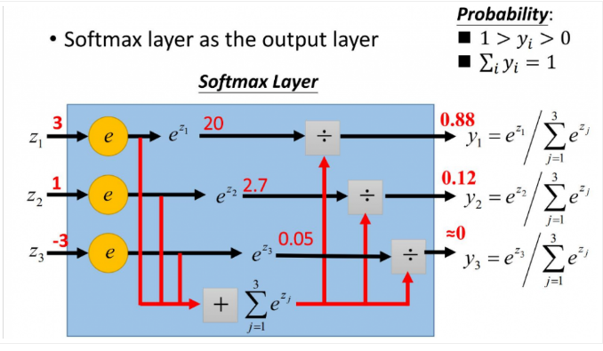

### 机器学习之MNIST

> MNIST是什么

---
#### MNIST是一个计算机视觉数据集([官网链接](http://yann.lecun.com/exdb/mnist/))，它包含各种手写数字图片


MNIST数据集分为两部分：

- 60000行的训练数据集（mnist.train）
- 10000行的测试数据集（mnist.test）

*测试数据集用于评估和预测*

每一个MNIST数据单元有两部分组成：一张包含手写数字的图片和一个对应的标签。我们把这些图片设为“xs”，把这些标签设为“ys”。训练数据集和测试数据集都包含xs和ys，比如训练数据集的图片是 mnist.train.images ，训练数据集的标签是 mnist.train.labels

每一张图片包含28x28个像素，而且都是黑白色构成（这里的黑色是一个0-1的浮点数，黑色越深表示数值越靠近1），我们可以用一个数字数组来表示这张图片：


**mnist.train.images 是一个形态为  [60000, 784] 的张量（tensor）。第一个维度表示图片个数的索引，第二个维度表示图片中每一个像素的索引。每一个像素的取值为0或1，表示该像素的亮度**
**mnist.train.labels 是一个结构为 [60000, 10] 的张量**

> softmax函数

---
#### softmax用于多分类过程中，它将多个神经元的输出，映射到（0,1）区间内，可以看成概率来理解:
$$S_i=\frac{e^i}{\sum_je^j}$$

*softmax就是将原来输出是3,1,-3通过softmax函数作用，就映射成为(0,1)的值，而这些值的累和为1（满足概率的性质），那么我们就可以将它理解成概率，在最后选取输出结点的时候，我们就可以选取概率最大（也就是值对应最大的）结点，作为我们的预测目标*

> softmax函数在MNIST中的应用
---
对图片进行分类(0...9)：
*在训练的过程中，我们需要设定额外的偏置量（bias）以排除在输入中引入的干扰数据。下图表示证据的提取计算公式，对于分类$i$给定一个$x$的输入得到*
$$evidence_i=\sum_jW_{i,j}x_j+b_i$$

::: warning 备注
- w的形状是一个[784,10]的张量，第一个向量表示每个图片都有784个像素点，第二个向量表示从“0”到“9”一共有10类图片
- b的形状是[10]，他仅表示10个分类的偏移值
:::

```python
# x是特征值
x = tf.placeholder(tf.float32, [1, 784])
# tf.zeros表示所有的维度都为0 
W = tf.Variable(tf.zeros([784, 10]))
b = tf.Variable(tf.zeros([10]))
```

这里$i$表示分类（$i$=[0...9]），$j$表示图片$x$的像素索引（$j$=[0...784]）、$W_{ij}$表示分类$i$在像素点$j$的加权值、$x_j$表示图片$x$在$j$像素点的值（$x_j$=[0,1]），$b_i$表示分类$i$的偏移量。然后用softmax函数将这些证据转换成一个概率值：

$$y=softmax(evidence)$$
进一步的展开公式：
$$softmax(x)_i=\frac{e^{x_i}}{\sum_je^{x_j}}$$
这个公式可以理解为：图片$x$在$i$分类中的加权值在所有加权值中的占比

对于softmax回归模型可以用下面的图解释，$x_j$表示一个像素点（下图中$j$=[1,2,3]）。然后通过像素点与权重$W_{ij}$的乘积求和（下图中$i$=[1,2,3]）再加上偏移量$b_i$得到模型值，最后将模型进行softmax运算：


表示成矩阵写法：


最后的总结：
$$y=softmax(Wx+b)$$

*如果想了解更多关于softmax回归的细节，[请阅读Michael Nieslen书中关于softmax的说明](http://neuralnetworksanddeeplearning.com/chap3.html#softmax)*

> 在TensorFlow中仅仅一行代码就可以实现整个运算过程
---
```python
y = tf.nn.softmax(tf.matmul(x, W) + b)
```
