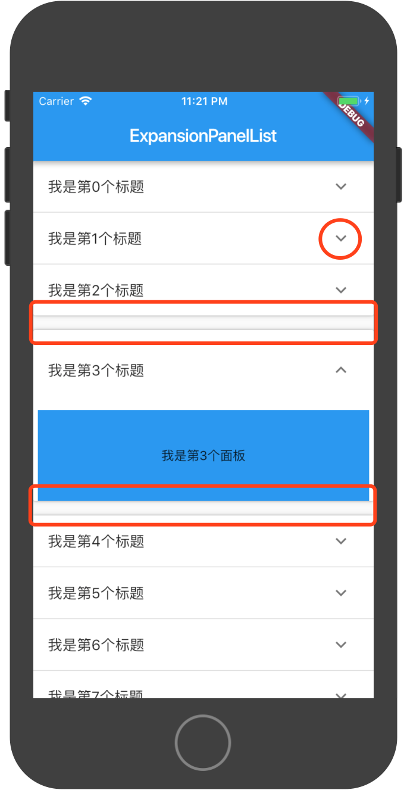
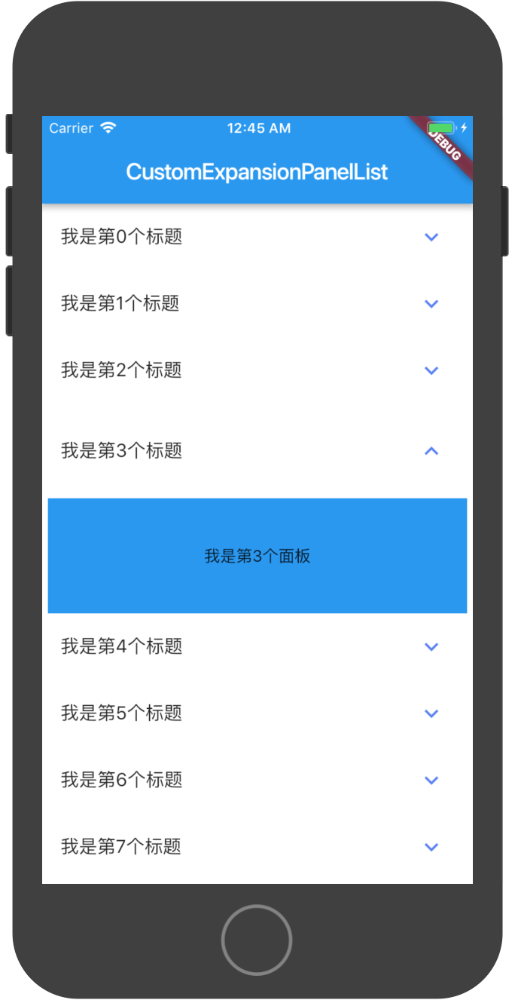

### Flutter中自定义ExpansionPanelList组件

::: tip Flutter中原生的ExpansionPanel(伸缩面板)组件实现的效果并不能满足常规的需求
本文主要讲述如何自定义一个ExpansionPanelList组件，解决原生组件中的痛点
:::


- 痛点一：打开的面板与相邻的标题有间隙，效果真的很丑
- 痛点二：面板的下拉icon颜色跟着flutter theme走，不能修改颜色，也没有color的属性
---


> 解决方案
---

- 自定义ExpandIcon组件,增加color属性或者其他属性（增加该组件的扩展性）

**思路：增加color属性**
``` dart{10,19,79}
import 'dart:math' as math;
import 'package:flutter/widgets.dart';
import 'package:flutter/material.dart';

class CustomExpandIcon extends StatefulWidget {
  const CustomExpandIcon({
    Key key,
    this.isExpanded = false,
    this.size = 24.0,
    this.color = Colors.lightBlueAccent,
    @required this.onPressed,
    this.padding = const EdgeInsets.all(8.0)
  }) : assert(isExpanded != null),
        assert(size != null),
        assert(padding != null),
        super(key: key);

  final bool isExpanded;
  final Color color;
  final double size;
  final ValueChanged<bool> onPressed;
  final EdgeInsetsGeometry padding;

  @override
  _CustomExpandIconState createState() => _CustomExpandIconState();
}

class _CustomExpandIconState extends State<CustomExpandIcon> with SingleTickerProviderStateMixin {
  AnimationController _controller;
  Animation<double> _iconTurns;

  static final Animatable<double> _iconTurnTween = Tween<double>(begin: 0.0, end: 0.5)
      .chain(CurveTween(curve: Curves.fastOutSlowIn));

  @override
  void initState() {
    super.initState();
    _controller = AnimationController(duration: kThemeAnimationDuration, vsync: this);
    _iconTurns = _controller.drive(_iconTurnTween);
    if (widget.isExpanded) {
      _controller.value = math.pi;
    }
  }

  @override
  void dispose() {
    _controller.dispose();
    super.dispose();
  }

  @override
  void didUpdateWidget(CustomExpandIcon oldWidget) {
    super.didUpdateWidget(oldWidget);
    if (widget.isExpanded != oldWidget.isExpanded) {
      if (widget.isExpanded) {
        _controller.forward();
      } else {
        _controller.reverse();
      }
    }
  }

  void _handlePressed() {
    if (widget.onPressed != null)
      widget.onPressed(widget.isExpanded);
  }

  @override
  Widget build(BuildContext context) {
    assert(debugCheckHasMaterial(context));
    assert(debugCheckHasMaterialLocalizations(context));
    final MaterialLocalizations localizations = MaterialLocalizations.of(context);
    final String onTapHint = widget.isExpanded ? localizations.expandedIconTapHint : localizations.collapsedIconTapHint;

    return Semantics(
      onTapHint: widget.onPressed == null ? null : onTapHint,
      child: IconButton(
        padding: widget.padding,
        color: widget.color,
        onPressed: widget.onPressed == null ? null : _handlePressed,
        icon: RotationTransition(
            turns: _iconTurns,
            child: const Icon(Icons.expand_more)
        ),
      ),
    );
  }
}
```

- 自定义ExpansionPanelList组件，修改其原有的实现效果

**思路：去除组件中原有的dividers, Material Widget属性shadowColor设为透明,引用CustomExpandIcon组件**
``` dart{2,34,35,36,37,38,39,60,61,78,103,104,105,106,107}
import 'package:flutter/material.dart';
import 'custom_expand_icon.dart';

const double _kPanelHeaderCollapsedHeight = 58.0;
const double _kPanelHeaderExpandedHeight = 70.0;

class CustomExpansionPanelList extends StatelessWidget {
  const CustomExpansionPanelList(
      {Key key,
      this.children: const <ExpansionPanel>[],
      this.expansionCallback,
      this.animationDuration: kThemeAnimationDuration})
      : assert(children != null),
        assert(animationDuration != null),
        super(key: key);

  final List<ExpansionPanel> children;

  final ExpansionPanelCallback expansionCallback;

  final Duration animationDuration;

  bool _isChildExpanded(int index) {
    return children[index].isExpanded;
  }

  @override
  Widget build(BuildContext context) {
    final List<Widget> items = <Widget>[];
    const EdgeInsets kExpandedEdgeInsets = const EdgeInsets.symmetric(
        vertical: _kPanelHeaderExpandedHeight - _kPanelHeaderCollapsedHeight);

    for (int index = 0; index < children.length; index += 1) {
//      if (_isChildExpanded(index) && index != 0 && !_isChildExpanded(index - 1))
//        items.add(new Divider(
//          key: new _SaltedKey<BuildContext, int>(context, index * 2 - 1),
//          height: 15.0,
//          color: Colors.transparent,
//        ));
      final Row header = new Row(
        children: <Widget>[
          new Expanded(
            child: new AnimatedContainer(
              duration: animationDuration,
              curve: Curves.fastOutSlowIn,
              margin: _isChildExpanded(index)
                  ? kExpandedEdgeInsets
                  : EdgeInsets.zero,
              child: new SizedBox(
                height: _kPanelHeaderCollapsedHeight,
                child: children[index].headerBuilder(
                  context,
                  children[index].isExpanded,
                ),
              ),
            ),
          ),
          new Container(
            margin: const EdgeInsetsDirectional.only(end: 8.0),
            child: new CustomExpandIcon(
              color: Color(0xff597ef7),
              isExpanded: _isChildExpanded(index),
              padding: const EdgeInsets.all(16.0),
              onPressed: (bool isExpanded) {
                if (expansionCallback != null)
                  expansionCallback(index, isExpanded);
              },
            ),
          ),
        ],
      );

      items.add(
        new Container(
          key: new _SaltedKey<BuildContext, int>(context, index * 2),
          child: new Material(
            color: Color(0xffffffff),
            shadowColor: Color.fromRGBO(50, 51, 70, 0),
            elevation: 2.0,
            borderOnForeground: false,
            child: new Column(
              children: <Widget>[
                header,
                new AnimatedCrossFade(
                  firstChild: new Container(height: 0.0),
                  secondChild: children[index].body,
                  firstCurve:
                      const Interval(0.0, 0.6, curve: Curves.fastOutSlowIn),
                  secondCurve:
                      const Interval(0.4, 1.0, curve: Curves.fastOutSlowIn),
                  sizeCurve: Curves.fastOutSlowIn,
                  crossFadeState: _isChildExpanded(index)
                      ? CrossFadeState.showSecond
                      : CrossFadeState.showFirst,
                  duration: animationDuration,
                ),
              ],
            ),
          ),
        ),
      );

//      if (_isChildExpanded(index) && index != children.length - 1)
//        items.add(new Divider(
//          key: new _SaltedKey<BuildContext, int>(context, index * 2 + 1),
//          height: 15.0,
//        ));
    }

    return new Column(
      children: items,
    );
  }
}

class _SaltedKey<S, V> extends LocalKey {
  const _SaltedKey(this.salt, this.value);

  final S salt;
  final V value;

  @override
  bool operator ==(dynamic other) {
    if (other.runtimeType != runtimeType) return false;
    final _SaltedKey<S, V> typedOther = other;
    return salt == typedOther.salt && value == typedOther.value;
  }

  @override
  int get hashCode => hashValues(runtimeType, salt, value);

  @override
  String toString() {
    final String saltString = S == String ? '<\'$salt\'>' : '<$salt>';
    final String valueString = V == String ? '<\'$value\'>' : '<$value>';
    return '[$saltString $valueString]';
  }
}
```
> 最终效果
---
